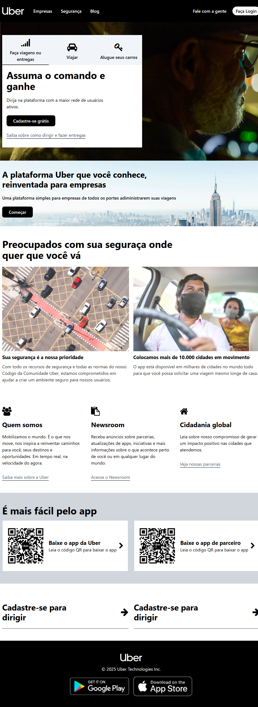

# 🚗 Clone Uber com Tailwind

Este é um projeto **clone da página inicial da Uber**, feito com foco em **praticar Tailwind CSS** e **responsividade mobile**.  
O projeto utiliza **HTML5** e **TailwindCSS** puro, sem frameworks JavaScript.



---

## 🛠️ Tecnologias Utilizadas

- HTML5  
- Tailwind CSS  
- Git & GitHub

---

## 📱 Responsividade

Este projeto foi construído com foco em **dispositivos móveis**, utilizando as classes utilitárias do Tailwind para garantir uma ótima experiência em telas menores.

---

## 🚀 Como rodar o projeto

> ⚠️ Para rodar este projeto localmente, você precisa ter o **Node.js** e o **npm** instalados na sua máquina.

1. Clone este repositório:
   ```bash
   git clone https://github.com/felipejmadruga/clone-uber-tailwind
 
 2. Acesse a pasta do projeto: 

    cd clone-uber-tailwind

3. Instale as depenências:

    npm install

4. Inicie o projeto:

    npm run dev

5. Acesse no navegador:

    O terminal mostrará o link (geralmente http://localhost:3000/) — é só clicar ou colar no navegador.

## 🧑‍💻 Autor

**Felipe Madruga**

github.com/felipejmadruga

## 📝 Como adicionar este README ao projeto e subir para o GitHub

1. Copie este conteúdo e salve no arquivo README.md na raiz do seu projeto.

2. No Git Bash, execute os comandos abaixo:

    git add README.md

    git commit -m "Adiciona README.md com informações do projeto"

    git push origin main
    
